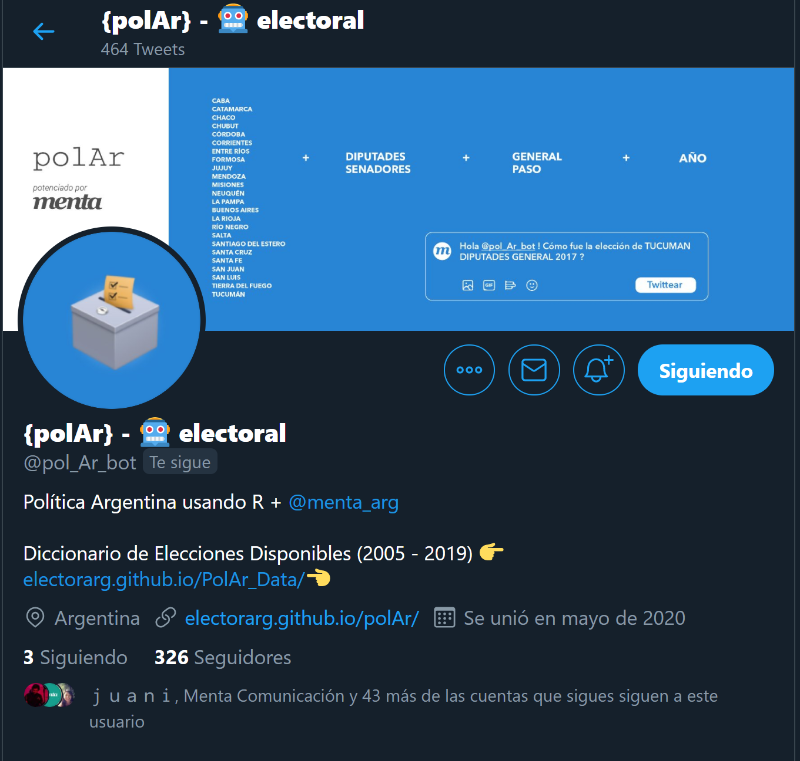

layout:true


```{r setup, include=FALSE}
options(htmltools.dir.version = FALSE)
knitr::opts_chunk$set(collapse = TRUE,
                      fig.retina = 3,
                      out.width = 300, ### control plot size
                      ccache = TRUE,
                      warning = FALSE,
                      message = FALSE)


xaringanExtra::use_xaringan_extra(include = c("panelset", "tile_view", "webcam", "editable"))

library(polAr)
library(tidyverse)

```


```{r xaringan-panelset, echo=FALSE}
xaringanExtra::use_panelset()
```

```{r xaringan-broadcast, echo=FALSE}
xaringanExtra::use_broadcast()
```


```{r xaringan-logo, echo=FALSE}
xaringanExtra::use_logo("https://raw.githubusercontent.com/electorArg/polAr/master/hex/hex-polAr.png", width = "100px")
```

---

class: center, hide_logo

background-image: url(https://raw.githubusercontent.com/LatinR/identidad-visual-latinR/master/LatinR_hex_violeta.png)
background-position: 50% 100%
background-size: 30%


#### JUAN PABLO RUIZ NICOLINI

#### Universidad Torcuato Di Tella

##### [`r icon::fa("globe")`](https://www.tuqmano.com/) [tuqmano.com](https://www.tuqmano.com/) 

##### [`r icon::fa("twitter")`](https://twitter.com/TuQmano)  [TuQmano](https://twitter.com/TuQmano) 

##### [`r icon::fa("github")`](https://github.com/tuqmano) [TuQmano](https://github.com/tuqmano)


### Octubre, 2020

???

* politologo y cientista de datos

* HOY vengo a mostrar un producto que comparte la historia de su desarrollo con LatinR


---
class: hide_logo

background-image: url(https://raw.githubusercontent.com/LatinR/identidad-visual-latinR/master/LatinR_hex_violeta.png)
background-position: 90% 10%
background-size: 20%

# Buenos Aires (2018)
## Argentina 


.pull-left[


```{r bsas, echo=F, fig.align='center'}
knitr::include_graphics("polar_slides_files/img-manual/bsas.PNG")
```

* Generación de grillas de Argentina y las 24 provincias. 
* 2020: la mayoría de ellas fueron incorporadas en repositorio oficial de [geofacet](https://hafen.github.io/geofacet/)


]

???

* Compartir mi primera experiencia como 'desarrollador' diseñando grillas para distritos de ARG

* Que con el tiempo terminaron siendo contribuciones en el repo oficial de GEOFACET


* Y ESTE AÑO TERMINÓ SIENDO MI PRIMER PAQEUTE (DISPONIBLE EN GITHUB)

* DISPONIBILIZANDO GRILLAS Y FUNCIONES AUXILIARES COMO DICCIONARIO DE CODIGOS DISTRITALES Y RECODIFICACION DE IDS

--


.pull-right[

`r emojifont::emoji("package")` **geofaceteAR (2020)**

##### [https://github.com/electorArg/geofaceteAR](https://github.com/electorArg/geofaceteAR)

```{r geofaceteAr,echo=F, fig.align='center'}

  knitr::include_graphics("polar_slides_files/img-manual/geofacetear.PNG")

```
]


---
class: hide_logo

background-image: url(https://raw.githubusercontent.com/LatinR/identidad-visual-latinR/master/LatinR_hex_violeta.png)
background-position: 90% 10%
background-size: 20%

# Santiago (2019)
## Chile 

.pull-left[
```{r chile, echo=F}
knitr::include_graphics("polar_slides_files/img-manual/ie.PNG")
```
**Inteligencia Electoral**

Presentación | _Shinny_ app

_(con Juan Pablo Pilorget)_

]


???

* en SANTIAGO tuve posibilidad de presentar 1ra Version de INTELIGENICA ELECTORAL

* limpieza y procesamiento de un gran volumen de datos de elecciones presidenciales


* además de la posibliidad del tutorial de desarrollo de paquete con Hadley Wickham 

* condición necesaria tanto de GEOFACETEAR como de lo que acá vengo a presentar


--

.pull-right[


```{r hw,echo=F}

  knitr::include_graphics("polar_slides_files/img-manual/hw.PNG")

```
**Package Development**

Tutorial

]

---
class: hide_logo

background-image: url(https://raw.githubusercontent.com/LatinR/identidad-visual-latinR/master/LatinR_hex_violeta.png)
background-position: 90% 10%
background-size: 20%

# .can-edit[Montevideo (2020)]


```{r polar_logo, echo = FALSE, fig.align='center'}
 knitr::include_graphics("https://raw.githubusercontent.com/electorArg/polAr/master/hex/hex-polAr.png")
```


???

* AUNQUE CON ALGUNOS CAMBIOS... COMO TODOS SABEMOS


---


#### Juan Pablo Ruiz Nicolini | **@TuQmano**  | LatinR 2020 

### Análisis de Datos Políicos de Argentina

#### `r emojifont::emoji("package")``{polAr}`  facilita el acceso a datos políticos de Argentina y provee herramientas para el análisis explortario, descarga, cálculos y visualización de la información.

???

* HOY VENGO A PRESETNAR polAr: paquete que facilita herramientas y el acceso a datos para el análisis político de argentina 


--

`r emojifont::emoji("loudspeaker")` discursos presidenciales 

--


`r emojifont::emoji("raising_hand")`votaciones legislativas;

--


`r emojifont::emoji("earth_americas")` datos para análisis georeferenciados; 

--

`r emojifont::emoji("envelope")` resultados electorales;

???

* PARA ESTOS TOPICOS, EL PAQEUTE OFRECE 3 FAMILIAS DE FUNCIONES


--

#### Tipos de tareas


`r emojifont::emoji("mag")` EXPLORAR: funciones `show_*()` 

--

`r emojifont::emoji("inbox_tray")` DESCARGAR: funciones `get_*()`

--

`r emojifont::emoji("bar_chart")` VISUALIZAR: funciones `plot_*()`, `map_*()`,`tabulate_*()`


---


#### Juan Pablo Ruiz Nicolini | **@TuQmano**  | LatinR 2020  

### Análisis de Datos Políicos de Argentina


### `r emojifont::emoji("loudspeaker")` DISCURSOS

.panelset[

.panel[.panel-name[`r emojifont::emoji("mag")`Explorar]


```{r}
show_available_speech()
```

]

.panel[.panel-name[`r emojifont::emoji("inbox_tray")`Descargar]

.pull-left[
```{r speech_tidy}
get_speech(year = 1946) 
```
]

.pull-right[
```{r speech_raw}
get_speech(year = 1946, 
           raw = T) %>% #<<
  pull(discurso)
```

`r emojifont::emoji("tv")` **_MinaR los discuRsos pResidenciales_** (con [Camila Higa](https://twitter.com/chig4_) y [Lucas Enrich](https://twitter.com/lucasenrich); LatinR, 2020)

]


]

.panel[.panel-name[`r emojifont::emoji("bar_chart")`Visualizar]

.pull-left[

```{r, eval=F}
get_speech(year = 1946) %>% 
plot_speech() #<<
```

]

.pull-right[

```{r word_cloud, echo=F}

knitr::include_graphics(path = "polar_slides_files/img-manual/peron_1946.png")

```
]
]


]

---

#### Juan Pablo Ruiz Nicolini | **@TuQmano**  | LatinR 2020 

### Análisis de Datos Políicos de Argentina


### `r emojifont::emoji("raising_hand")` LEGISLATIVAS


.panelset[

.panel[.panel-name[`r emojifont::emoji("mag")`Explorar]

```{r bill_explore}
show_available_bills(viewer = F)  
```

]

.panel[.panel-name[`r emojifont::emoji("inbox_tray")`Descargar]


```{r bill_votes}
get_bill_votes(bill = "3507-Diputados") 
```

]


.panel[.panel-name[`r emojifont::emoji("bar_chart")`Visualizar]

Grafica el acumulado de opciones de una votación

.pull-left[
```{r bill_ggparliament_code, eval=F}
  plot_bill(id = "3507-Diputados") 
```
]

.pull.right[

```{r bill_ggparliament, echo=FALSE}
  plot_bill(id = "3507-Diputados") 
```


]
]
]

---

#### Juan Pablo Ruiz Nicolini | **@TuQmano**  | LatinR 2020 

### Análisis de Datos Políicos de Argentina


### `r emojifont::emoji("earth_americas")` GEO


.panelset[

.panel[.panel-name[`r emojifont::emoji("mag")`Explorar]

```{r codes_explore}
show_arg_codes(viewer = F)  # level = "departamento disponible
```

]

.panel[.panel-name[`r emojifont::emoji("inbox_tray")`Descargar Grilla]

.pull-left[
```{r grid code, eval = F}
get_grid(district = "TUCUMAN") %>% #<< 
  geofacet::grid_preview() 
```
]

.pull-right[
```{r grid, echo = F}
get_grid(district = "TUCUMAN") %>% 
  geofacet::grid_preview()
```
]

]

.panel[.panel-name[`r emojifont::emoji("inbox_tray")`Descargar geometry]

.pull-left[

```{r geo , eval = F, warning=FALSE}
get_geo(geo =  "TUCUMAN") %>%  #<<
  ggplot2::ggplot() +
  ggplot2::geom_sf() +
  ggplot2::geom_sf_label(aes(label = coddepto))


```
]

.pull-right[

```{r geo plot, echo = F, warning=FALSE}

get_geo(geo =  "TUCUMAN") %>%  #<<
  ggplot2::ggplot() +
  ggplot2::geom_sf() +
  ggplot2::geom_sf_label(aes(label = coddepto))


```
]

]

]

---

#### Juan Pablo Ruiz Nicolini | **@TuQmano**  | LatinR 2020 

### Análisis de Datos Políicos de Argentina


### `r emojifont::emoji("envelope")` ELECCIONES


.panelset[
.panel[.panel-name[`r emojifont::emoji("mag")`Explorar]


```{r election_show}
show_available_elections() 
```

]

.panel[.panel-name[`r emojifont::emoji("inbox_tray")`Descargar]

```{r election_get}
get_election_data(district = "caba", category = "dip",
                  round = "gral", year =  2019) 
```

]


.panel[.panel-name[`r emojifont::emoji("bar_chart")`Graficar]


```{r election_plot}
get_election_data(district = "caba", category = "dip",
                  round = "gral", year =  2019) %>% 
  plot_results() #<<

```

]

.panel[.panel-name[`r emojifont::emoji("bar_chart")`Mapear]


```{r election_map}
get_election_data(district = "caba", category = "dip",
                  round = "gral", year =  2019,
                  level = "departamento") %>%  #<<
  map_results() #<<

```

]

.panel[.panel-name[`r emojifont::emoji("bar_chart")`Tabular]


```{r election_table}
get_election_data(district = "caba", category = "dip",
                  round = "gral", year =  2019) %>% 
  tabulate_results() #<<

```

]


]


---

#### Juan Pablo Ruiz Nicolini | **@TuQmano**  | LatinR 2020 

### Análisis de Datos Políicos de Argentina


### `r emojifont::emoji("envelope")` ELECCIONES


.panelset[

.panel[.panel-name[`r emojifont::emoji("computer")`Computar]


```{r election_seats}
get_election_data(district = "caba", category = "dip",
                  round = "gral", year =  2019) %>% 
  compute_seats() #<<

```


#### Otros cálculos en la familia de funciones  `compute_*`: 

##### `compute_nep()`, `compute_competitiveness()`, `compute_disproportion()`, `compute_concentration()`

]

]


---

#### Juan Pablo Ruiz Nicolini | **@TuQmano**  | LatinR 2020 

##  `r emojifont::emoji("robot")` electoral  
##### (con [Camila Higa](https://twitter.com/chig4_) - [mentaComuniación](https://twitter.com/menta_arg))

```{r polar_bot, echo = FALSE, fig.align='center', out.width="50%"}
 
```

#### -> [`r icon::fa("twitter")`](https://twitter.com/pol_Ar_bot) [twitter.com/pol_Ar_bot](https://twitter.com/pol_Ar_bot) 

???

* ADEMAS de PolArBot UN PROYECTO LATERAL, BASADO EN LOS VERBOS PARA  ELECTORALES ES POL AR BOT


---

#### Juan Pablo Ruiz Nicolini | **@TuQmano**  | LatinR 2020 

### Análisis de Datos Políicos de Argentina

#### SLIDES `r icon::fa("hand-point-down")`

#### [https://www.tuqmano.com/slides/polar_slides.html](https://www.tuqmano.com/slides/polar_slides.html)


.pull-left[

### `{polAr}`
#### [`r icon::fa("globe")`](https://electorarg.github.io/polAr/) [electorarg.github.io/polAr/](https://electorarg.github.io/polAr/) 
#### [`r icon::fa("twitter")`](https://twitter.com/pol_Ar_bot)  [pol_Ar_bot](https://twitter.com/pol_Ar_bot) 
#### [`r icon::fa("github")`](https://github.com/electorArg/polAr/) [electorArg/polAr/](https://github.com/electorArg/polAr/)
]


.pull-right[

### `TuQmano`
#### [`r icon::fa("globe")`](https://www.tuqmano.com/) [tuqmano.com](https://www.tuqmano.com/) 
#### [`r icon::fa("twitter")`](https://twitter.com/TuQmano)  [TuQmano](https://twitter.com/TuQmano) 
#### [`r icon::fa("github")`](https://github.com/tuqmano) [TuQmano](https://github.com/tuqmano)


]

## GRACIAS!!!


