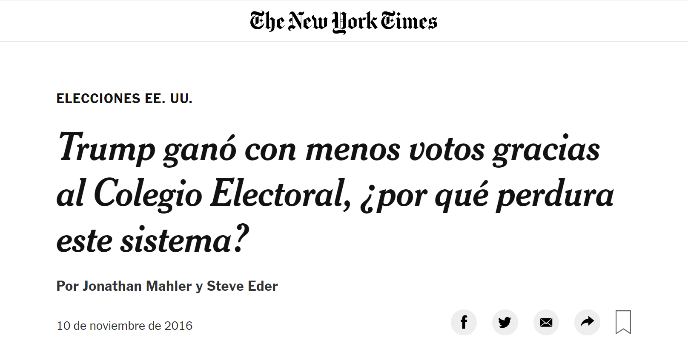
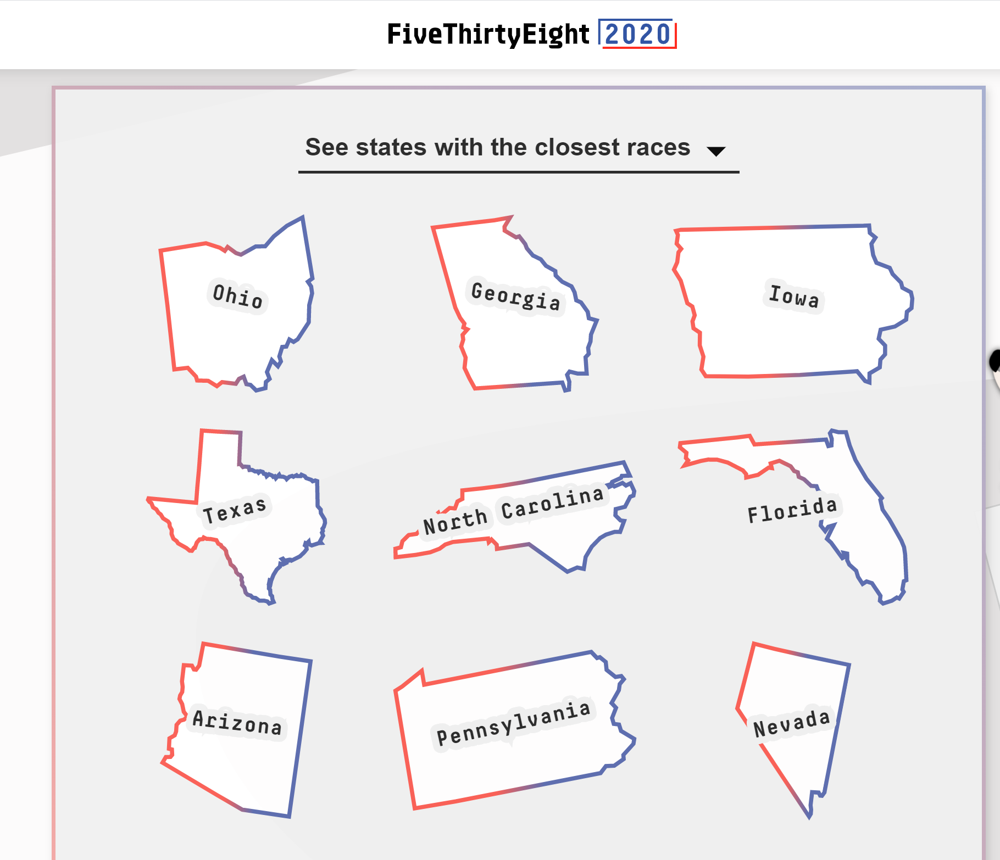
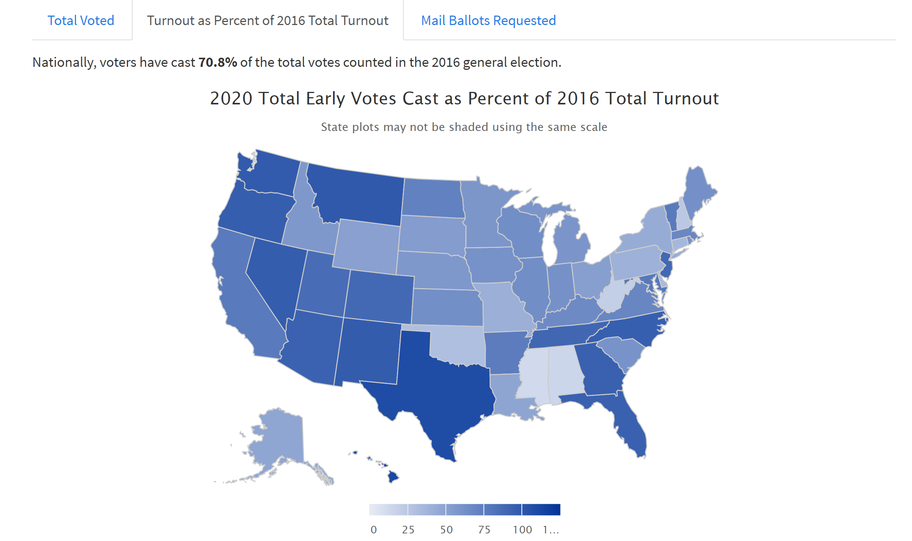

layout:true


```{r setup, include=FALSE}
options(htmltools.dir.version = FALSE)
knitr::opts_chunk$set(collapse = TRUE,
                      fig.retina = 3, ### control plot size
                      ccache = TRUE,
                      warning = FALSE,
                      message = FALSE)


xaringanExtra::use_xaringan_extra(include = c("panelset", "tile_view", "webcam", "editable", "share_again"))

library(polAr)
library(tidyverse)

```

---

class: center, middle


### Colegio Electoral vs Voto Popular
#### **¿Cómo interpretar los resultados electorales de EE.UU.?**

.pull-left[

#### JP RUIZ NICOLINI

##### UTDT
##### [`r icon::fa("twitter")`](https://twitter.com/TuQmano)  [TuQmano](https://twitter.com/TuQmano) 


]

.pull-right[

#### JAVIER CACHÉS
##### UTDT / UBA
##### [`r icon::fa("twitter")`](https://twitter.com/javicaches)  [javicaches](https://twitter.com/javicaches) 


]

#### 3 de noviembre de 2020

```{r, echo=FALSE, out.width="25%", strip.white=TRUE}
knitr::include_graphics("https://www.uade.edu.ar/media/kh1hx5wh/logo_mesa-de-trabajo-1-copia.png")
```

#### LICENCIATURA EN GOBIERNO Y RELACIONES INTERNACIONALES

---
class: middle, center, inverse

### La mayoría de los norteamericanos votó por Hillary Clinton

> _ La mayoría de los norteamericanos la quiso a ella, no a él.  Pero tenemos un sistema arcaico e inadecuado, llamado Colegio Electoral, que lo hizo presidente_

**[Michael Moore](https://www.facebook.com/mmflint/posts/10153913074756857)**


---
```{r, echo  = FALSE}

```


---
class: middle, center, inverse


### El Colegio Electoral en la mira

> El  Colegio  Electoral,  el órgano  que  elige  al  presidente,  le  costó  cuatro  presidencias  a  los demócratas:   dos  en  este  siglo,  y  en  1876  y  1888.   Al  Gore  ganó  el  voto  popular  en  las elecciones  de  2000,  pero  el  triunfo  fue  de  George  W.  Bush.   Hillary  Clinton  cosechó  más votos que Trump, pero tampoco pisará la Casa Blanca  

**[Rafael Mathus Ruiz](https://www.lanacion.com.ar/el-mundo/el-colegio-electoral-en-la-mira-nid1955239/) (_La Nación_)**


---


## Reglas electorales, incentivos y comportamiento de los votantes.

>	*No hay que tomar al voto popular como una medida de quién hubiera ganado si no existiese el Colegio Electoral* 

> **-Noam Lupu (2016)**

--

### Instituciones Electorales

--

- Elección indirecta (Colegio Electoral)

--

- *Winner takes all*

--

- Voto optativo

--

#### **[`r icon::fa("hand-point-right")`](https://www.researchgate.net/publication/319332286) [Hipótesis](https://www.researchgate.net/publication/319332286)**: mayor competitividad electoral del distrito, mayor es la participación electoral 
---

class: inverse

### ¿Qué nos dicen los datos?

```{r, out.width="100%", echo=FALSE}

knitr::include_graphics("https://github.com/TuQmano/popular_vote/raw/master/plots/turnount_ts.png")

```

---

```{r, echo=FALSE}

library(tidyverse) # Easily Install and Load the 'Tidyverse', CRAN
library(gt)

#### Analisis de casos (años) 3 ELECCIONES CERRADAS

elec2000 <- tibble::tribble(
          ~Estado, ~Diferencia,    ~Dem,    ~Rep,
        "Florida",      "0.0%", "48.8%", "48.9%",
      "Wisconsin",      "0.2%", "47.8%", "47.6%",
           "Iowa",      "0.3%", "48.5%", "48.2%",
         "Oregon",      "0.4%", "46.9%", "46.5%",
   "Nuevo Mexico",      "1.0%", "47.9%", "47.8%",
  "New Hampshire",      "1.2%", "46.8%", "48.0%",
       "Minesota",      "2.4%", "47.9%", "45.5%",
         "Misuri",      "3.3%", "47.1%", "50.4%",
           "Ohio",      "3.5%", "46.5%", "50.0%",
         "Nevada",      "3.5%", "46.0%", "49.5%"
  )%>% 
  mutate(eleccion = 2000)


elec2012 <- tibble::tribble(
               ~Estado, ~Diferencia,    ~Dem,    ~Rep,
             "Florida",      "0.6%", "49.9%", "49.3%",
                "Ohio",      "1.9%", "50.1%", "48.2%",
  "Carolina del Norte",      "2.2%", "48.4%", "50.6%",
            "Virginia",      "3.0%", "50.8%", "47.8%",
            "Colorado",      "4.7%", "51.2%", "46.5%",
         "Pensilvania",      "5.2%", "52.0%", "46.8%",
                "Iowa",      "5.6%", "52.1%", "46.5%",
       "New Hampshire",      "5.8%", "52.2%", "46.4%",
              "Nevada",      "6.6%", "52.3%", "45.7%",
           "Wisconsin",      "6.7%", "52.8%", "46.1%"
  )%>% 
  mutate(eleccion = 2012)

elec2016 <- tibble::tribble(
                           ~Estado, ~Diferencia,    ~Dem,    ~Rep,
                        "Michigan",      "0.3%", "47.6%", "47.3%",
                   "New Hampshire",      "0.4%", "47.6%", "47.2%",
                       "Wisconsin",      "1.0%", "46.9%", "47.9%",
                     "Pensilvania",      "1.2%", "47.6%", "48.8%",
                         "Florida",      "1.2%", "47.8%", "49.0%",
                        "Minesota",      "1.5%", "46.4%", "44.9%",
                          "Nevada",      "2.4%", "47.9%", "45.5%",
                           "Maine",      "2.7%", "47.9%", "45.2%",
              "Carolina del Norte",      "3.8%", "46.1%", "49.9%",
                         "Arizona",      "3.9%", "49.3%", "45.4%"
              ) %>% 
  mutate(eleccion = 2016)


### TURNOUT - 3 CASOS (TABLAS)

# load data ####
presidential_year <- seq(from = 1980 , to = 2016, by = 4)

# TURNOUT 1980 - 2016
full_turnout_data <- read_delim("https://raw.githubusercontent.com/TuQmano/popular_vote/master/data/TurnoutLong.csv", delim = ";") %>% 
  filter(Year %in% presidential_year)


turnout_rename <- full_turnout_data %>% 
  filter(X4 == "VEP") %>% 
  select(-X4) %>%
  group_by(Year) %>% 
  mutate(turnout_mean = mean(Turnout)) %>% 
  rename(eleccion = Year, 
         Estado = STATE) 

datos_tablas <- rbind(elec2000, elec2012, elec2016) %>% 
  mutate(across(.cols = c(Diferencia, Dem, Rep), .fns = ~ str_remove_all(. ,pattern =  "%"))) %>% 
  mutate(across(.cols = c(Diferencia, Dem, Rep), ~ as.numeric(.))) %>% 
  mutate(Estado = case_when(
    Estado == "Carolina del Norte" ~ "North Carolina", 
    Estado == "Nuevo Mexico" ~ "New Mexico", 
    Estado == "Misuri" ~ "Missouri", 
    Estado == "Pensilvania" ~ "Pennsylvania", 
    Estado == "Minesota" ~ "Minnesota",  T ~ Estado
  )) %>% 
  left_join(turnout_rename) %>% 
  mutate(turnout = round(Turnout - turnout_mean,1), 
         year = eleccion) %>% 
  select(1:2, 8, eleccion, year, turnout_mean) %>% 
  arrange(year, desc(turnout)) %>% 
  group_by(eleccion) %>% 
  nest()  
  

Tablas <- datos_tablas %>% 
  mutate(tabla = map(data, ~ gt::gt(.) %>% 
                       tab_header(title = glue::glue("Elección Presidencial {eleccion}")) %>% 
                       cols_label(turnout = "Participación", 
                                  Diferencia = "|Dem - Rep|")  %>%
                       data_color(
    columns = vars(turnout),
    colors = scales::col_numeric(
      palette = c(
        "red",  "blue"),
      domain = c(-11, 15)))  %>%
      cols_hide(
        columns = vars(year, turnout_mean)
      )  %>%
      tab_footnote(
        footnote = "Distancia del promedio de participación inter estadual (puntos porcentuales)",
        locations = cells_column_labels(
          columns = vars(turnout))
      ) %>%
      cols_align(align = "center", columns = c("Diferencia", "turnout"))
    )) 


```


### Competitividad y participación electoral 


```{r echo=F, out.width="%"}

Tablas$tabla[[1]]# %>%  gtsave(filename = "2000.rtf")
```


---

### Competitividad y participación electoral 

```{r, echo=F, out.width="90%"}

Tablas$tabla[[2]]# %>% gtsave(filename = "2012.rtf")
```


---

### Competitividad y participación electoral

```{r, echo=F, out.width="90%"}

Tablas$tabla[[3]]# %>% gtsave(filename = "2016.rtf")
```
---
class: inverse 

### Participación y pronóstico electoral

```{r, echo=FALSE}
knitr::include_graphics("https://github.com/TuQmano/popular_vote/raw/master/plots/turnount_2016_facet.png")
```

---

### Competitividad 2020: carreras más cerradas

####[FiveThirtyEight](https://projects.fivethirtyeight.com/2020-election-forecast) Election Forecast

```{r, echo=FALSE, out.width="80%"}

```


---


### Participación 2020: voto anticipado y por correo

#### vs 2016 ([U.S. Elections Project](https://electproject.github.io/Early-Vote-2020G/))

```{r, echo=FALSE}



```


---

### (Otros) Determinantes de la participación electoral

#### Variables no observadas:

-Cultura política.

--

-Legislación electoral.

--

-Demografía.

--

-Elecciones concurrentes.

---
class: inverse

# EN RESUMEN

•	Una interpretación _sustantiva_ del _“**voto popular**”_ no es la mejor manera de leer los resultados.

--

•	El cálculo de **competitividad electoral** por estado, nos da una idea de incentivos en juego  para los electores y estrategias de las campañas de candidatos que pueden afectar los niveles de participación.

--

>Que el árbol (**_Colegio Electoral_**) no tape el bosque (un sistema con muchas deficiencias): 

--

*gerrymandering*, 

--

supresión del voto, 

--

voto optativo,

--

financiamiento de campaña (...)


---

class: inverse, middle

# GRACIAS! 

* Slides:  <https://tuqmano.com/talks/popular_vote>

* Datos y código disponibles en <https://github.com/TuQmano/popular_vote/>


.pull-left[

#### JP RUIZ NICOLINI

##### UTDT
##### [`r icon::fa("twitter")`](https://twitter.com/TuQmano)  [TuQmano](https://twitter.com/TuQmano) 


]

.pull-right[

#### JAVIER CACHÉS
##### UTDT / UBA
##### [`r icon::fa("twitter")`](https://twitter.com/javicaches)  [javicaches](https://twitter.com/javicaches) 


]


